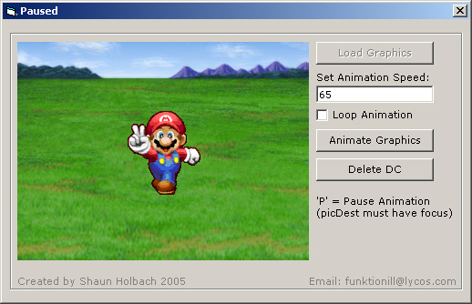



## Animation using BackBuffers and Device Contexts

### Description

loads graphics into memory and draws them to a BackBuffer, then to the primary Buffer.
 
### More Info
 
this code will show you how to animate without that sh*tty flickering. Assume you know how to use GetTickCount and BitBlt.

             |
---                |---
**Submitted On**   |2005-02-08 16:19:44
**By**             |[funktionvb](https://github.com/Planet-Source-Code/PSCIndex/blob/master/ByAuthor/funktionvb.md)
**Level**          |Advanced
**User Rating**    |4.9 (64 globes from 13 users)
**Compatibility**  |VB 6\.0
**Category**       |[Graphics](https://github.com/Planet-Source-Code/PSCIndex/blob/master/ByCategory/graphics__1-46.md)
**World**          |[Visual Basic](https://github.com/Planet-Source-Code/PSCIndex/blob/master/ByWorld/visual-basic.md)
**Archive File**   |[Animation\_185024282005\.zip](https://github.com/Planet-Source-Code/funktionvb-animation-using-backbuffers-and-device-contexts__1-58796/archive/master.zip)

